# Project Request Clarification Process Flowchart

This flowchart represents the operational workflow of `a-clarify-project-request`, whose human-readable stage name is **Project Request Clarification**.

It must remain synchronized with the `Workflow` and `Workflow Traceability` sections of `SKILL.md`. Technical actions and handoffs use exact skill identifiers; stage labels remain human-readable.

```mermaid
flowchart TD
    A[Start a-clarify-project-request] --> B{Does 00_inception exist?}

    B -- No --> B1[Report missing inception directory]
    B1 --> B2{User authorizes directory repair?}
    B2 -- No --> STOP[Stop and report blocking structural inconsistency]
    B2 -- Yes --> B3[Create missing inception directory]
    B3 --> C
    B -- Yes --> C{Does sources directory exist?}

    C -- No --> C1[Report missing sources directory]
    C1 --> C2{User authorizes directory repair?}
    C2 -- No --> STOP
    C2 -- Yes --> C3[Create missing sources directory]
    C3 --> D
    C -- Yes --> D{Do both inception READMEs exist?}

    D -- No --> D1[Report missing structural README]
    D1 --> D2{User authorizes README restoration?}
    D2 -- No --> STOP
    D2 -- Yes --> D3[Restore missing README from bundled template]
    D3 --> E
    D -- Yes --> E{Does trace_workflow.md exist?}

    E -- No --> E1[Report missing project-template-owned traceability file]
    E1 --> STOP
    E -- Yes --> F[Explain purposes of sources, Clarified Project Request, Project Context, and trace_workflow]

    F --> G[Receive informal project sources]
    G --> H[Discover relevant files under 00_inception sources]
    H --> I[Do not depend on a fixed source filename]
    I --> J[Preserve each source or record an external reference]
    J --> K[Do not modify preserved evidence]
    K --> L[Update Project request row: In Progress and Continue a-clarify-project-request]

    L --> M{Does clarified_project_request.md exist?}
    M -- No --> M1[Create from bundled template]
    M1 --> M2[Set Document state to Draft]
    M2 --> N
    M -- Yes --> M3[Load existing document without resetting it]
    M3 --> N

    N[Analyze sources and record metadata] --> O[Draft or update Initial Understanding]
    O --> P[Identify material project-level uncertainty]
    P --> Q[Create only necessary questions, maximum 20 total]
    Q --> R[Present a small clarification round]
    R --> S[Set Document state to Under Clarification]
    S --> T[Update Project request row with evidence, uncertainty, and Continue a-clarify-project-request]

    T --> U{Are stakeholder answers available?}
    U -- No --> U1[Present only the next necessary questions]
    U1 --> U2[Wait for stakeholder clarification]
    U2 --> U
    U -- Yes --> V[Record each answer, respondent, and impact]

    V --> W{Did new documentary evidence arrive?}
    W -- Yes --> W1[Preserve it as a new source file]
    W1 --> Y
    W -- No --> X{Was the answer provided directly through chat without a source file?}
    X -- Yes --> X1[Record the chat answer in the Clarified Project Request]
    X1 --> Y
    X -- No --> Y[Update Initial Understanding]

    Y --> Z[Check contradictions, unsupported claims, stale content, and premature technical detail]
    Z --> AA{Does blocking uncertainty remain?}
    AA -- Yes --> AA1[Keep state Under Clarification and questions Open]
    AA1 --> AA2[Update Project request row with current blocker]
    AA2 --> P

    AA -- No --> AB[Set Document state to Pending Approval]
    AB --> AC[Update Project request row: approval pending and Obtain human approval]
    AC --> AD[Submit to authorized human approver]

    AD --> AE{Are decision, name, role, date, and blocking issues complete?}
    AE -- No --> AE1[Request missing approval information]
    AE1 --> AE
    AE -- Yes --> AF{Is Ready selected while blocking issues are present?}
    AF -- Yes --> AF1[Report contradictory approval and request correction]
    AF1 --> AE
    AF -- No --> AG[Record complete consistent human decision]
    AG --> AH[Set Document state to Closed]

    AH --> AI{Did the approver select Ready?}
    AI -- No --> AI1[Update Project request row: Blocked]
    AI1 --> AI2[Copy blocking issues and set Resolve with a-clarify-project-request]
    AI2 --> AI3[Do not pass downstream]
    AI3 --> END[End]

    AI -- Yes --> AJ[Update Project request row: Complete and Run b-form-project-context]
    AJ --> AK[Update Project context row: Not Started, Project Context Formation, Run b-form-project-context]
    AK --> AL[Pass approved Clarified Project Request to b-form-project-context]
    AL --> AM[Identify Project Context Formation as next stage]
    AM --> END

    STOP --> END
```



## Traceability Updates

`a-clarify-project-request` owns the `Project request` row in:

```text
sdlc_docs/trace_workflow.md
```

It may update the `Project context` row only to expose a valid approved handoff to `b-form-project-context`.

### When clarification begins

```text
Status: In Progress
Current activity: Request Clarification
Evidence: discovered source files
Missing or blocked: current uncertainty
Next action: Continue a-clarify-project-request
```

### While clarification is active

Keep the row synchronized with preserved source evidence, `00_inception/clarified_project_request.md`, the current blocking uncertainty, and the next clarification action.

### When human approval is pending

```text
Status: In Progress
Current activity: Request Clarification
Evidence: 00_inception/clarified_project_request.md
Missing or blocked: Human readiness approval pending
Next action: Obtain human approval
```

### After a valid `Ready` decision

Update `Project request` to:

```text
Status: Complete
Current activity: Request Clarification
Evidence: 00_inception/clarified_project_request.md
Missing or blocked: None
Next action: Run b-form-project-context
```

Update `Project context` to:

```text
Status: Not Started
Current activity: Project Context Formation
Evidence: approved 00_inception/clarified_project_request.md
Missing or blocked: Project Context not created
Next action: Run b-form-project-context
```

### After a `Not Ready` decision

```text
Status: Blocked
Current activity: Request Clarification
Evidence: 00_inception/clarified_project_request.md
Missing or blocked: documented approval blocking issues
Next action: Resolve blocking issues with a-clarify-project-request
```

## Flow Rules

- The project template creates the initial directories, structural README files, and `sdlc_docs/trace_workflow.md`.
- `a-clarify-project-request` verifies the project structure before beginning Project Request Clarification.
- Directory creation and README restoration require explicit user authorization.
- `a-clarify-project-request` verifies and updates `sdlc_docs/trace_workflow.md` but never creates, reconstructs, or restores it.
- If `sdlc_docs/trace_workflow.md` is missing, stop and report the structural inconsistency.
- Original source files are immutable evidence.
- Source discovery must not depend on a fixed filename.
- During normal execution, `a-clarify-project-request` creates or updates only:
  - `sdlc_docs/00_inception/clarified_project_request.md`
  - Rows owned or directly affected by `a-clarify-project-request` in `sdlc_docs/trace_workflow.md`
- Preserve unrelated traceability rows and active increment records.
- Ask no more than 20 project-level critical questions in total.
- Present questions in small clarification rounds and stop when the request is sufficiently clear.
- Keep the traceability table synchronized throughout the workflow, not only at the end.
- Only a human approver may select `Ready` or `Not Ready`.
- A valid approval requires decision, name, role, date, and blocking-issue information.
- `Ready` and recorded blocking issues are contradictory and must be corrected before closure.
- Run `b-form-project-context` only after a valid `Ready` approval with `Blocking Issues: None`.
- A `Not Ready` decision closes the document and blocks the downstream handoff.
