# Project Context Formation Flowchart

This flowchart represents the same control flow, states, stops, loops, classification rules, traceability updates, approval rules, and handoff as the numbered workflow in `SKILL.md`.

```mermaid
flowchart TD
    A1[1. Receive clarified_project_request.md] --> A2{2. Is it Closed, Ready, fully approved, and unblocked?}
    A2 -->|No| A3[3. Stop and report every failed approval condition]
    A2 -->|Yes| A4{4. Does trace_workflow.md exist?}
    A4 -->|No| A5[5. Stop; project template must provide it]
    A4 -->|Yes| A6[6. Guarded update: mark Project context In Progress and continue b-form-project-context]
    A6 --> A7[7. Preserve unrelated traceability rows]
    A7 --> A8{8. Does project_context.md exist?}
    A8 -->|No| A9[9. Create from template and set Draft]
    A8 -->|Yes| A10[10. Load supported content and history]
    A9 --> A17
    A10 --> A11{11. Is it Closed and affected by substantive new evidence or feedback?}
    A11 -->|No| A17[17. Extract confirmed project-level information]
    A11 -->|Yes| A12[12. Preserve prior approved version in version control]
    A12 --> A13[13. Increment version]
    A13 --> A14[14. Set Under Clarification]
    A14 --> A15[15. Clear active approval fields]
    A15 --> A16[16. Record new evidence and source]
    A16 --> A17
    A17 --> A18[18. Classify each substantive statement]
    A18 --> A19[19. Record evidence or basis]
    A19 --> A20[20. Update every affected substantive section]
    A20 --> A21[21. Mark unsupported non-blocking content as not identified]
    A21 --> A22[22. Do not convert absence into a negative fact]
    A22 --> A23{23. Is essential information missing, contradictory, or imprecise?}
    A23 -->|No| A24[24. Continue to validation]
    A24 --> A42[42. Run all validation invariants]
    A23 -->|Yes| A25[25. Identify all material uncertainties]
    A25 --> A26[26. Maintain at most 20 distinct Working Questions]
    A26 --> A27[27. Remove repeated or answered questions]
    A27 --> A28[28. Select next small round, normally 1 to 4]
    A28 --> A29[29. Set Under Clarification]
    A29 --> A30[30. Guarded trace update with current blockers]
    A30 --> A31[31. Ask small round and stop]
    A31 --> WAIT{Are answers or new evidence available in a later execution?}
    WAIT -->|No| A31
    WAIT -->|Yes| A32[32. Record statement, provider, source, and impact]
    A32 --> A33{33. Does evidence confirm a previous derived interpretation?}
    A33 -->|Yes| A34[34. Promote confirmed interpretation when required]
    A33 -->|No| A35{35. Does a statement mix fact and derived consequence?}
    A34 --> A35
    A35 -->|Yes| A36[36. Split and classify each statement independently]
    A35 -->|No| A37[37. Update every affected occurrence]
    A36 --> A37
    A37 --> A38[38. Preserve new evidence without replacing originals]
    A38 --> A39{39. Are classifications consistent across sections?}
    A39 -->|No| A40[40. Record blocking failure and correct all occurrences]
    A40 --> A39
    A39 -->|Yes| A41[41. Return to essential-information check]
    A41 --> A23
    A42 --> A43{43. Do all validation invariants pass?}
    A43 -->|No| A44[44. Create revision items or necessary Working Questions]
    A44 --> A45[45. Guarded trace update with validation blockers]
    A45 --> A46[46. Resolve failures and return to information check]
    A46 --> A23
    A43 -->|Yes| A47[47. Remove Working Questions]
    A47 --> A48[48. Set Pending Approval]
    A48 --> A49[49. Guarded trace update: human approval pending]
    A49 --> A50[50. Submit to authorized human reviewer and stop]
    A50 --> A51{51. Is exactly one decision recorded with complete reviewer data?}
    A51 -->|No| A52[52. Keep Pending Approval; request completion and stop]
    A52 --> A50
    A51 -->|Ready| A53{53. Are Blocking Issues or Feedback exactly None?}
    A53 -->|No| CORR[Treat contradictory approval as invalid; request correction and stop]
    CORR --> A50
    A51 -->|Not Ready| A54[54. Keep open and set Under Clarification]
    A54 --> A55[55. Treat feedback as required revision evidence]
    A55 --> A56[56. Clear approval fields; preserve history]
    A56 --> A57[57. Guarded trace update with feedback blocker]
    A57 --> A58[58. Return to affected-section update]
    A58 --> A20
    A53 -->|Yes| A59[59. Set Closed]
    A59 --> A60[60. Guarded update: mark Project context Complete; run c-manage-product-requirements]
    A60 --> A61[61. Guarded update of authorized Initial requirements handoff fields]
    A61 --> A62[62. Preserve unrelated rows and evidence]
    A62 --> A63[63. Deliver approved context to c-manage-product-requirements]
    A63 --> A64[64. Report files, validation, approval, authorized changed fields, and rejected unauthorized changes]
```

## Alignment Rules

- Nodes 1–64 correspond to the numbered workflow steps.
- The answer-availability decision visualizes the stop-and-resume behavior required by Step 31.
- Every stop in the workflow is visible in the diagram.
- Closed-document revision preserves history, increments version, clears approval, and requires reapproval.
- New evidence triggers classification review, mixed-statement splitting, all-occurrence updates, and consistency validation.
- Every traceability update uses the Traceability Mutation Guard before saving; unauthorized row or field changes are rejected.
- `Initial requirements` remains `Not Started` after handoff preparation.
- The mutation guard is resolved from `.agents/skills/b-form-project-context/scripts/validate_trace_mutation.py` relative to the repository root; missing or failed execution stops the workflow and manual fallback is forbidden.
