# Product Requirements Management Flowchart

This Mermaid flowchart is the exact visual mirror of the numbered workflow in `SKILL.md`. Nodes 1–76 must remain one-to-one with the written steps.

```mermaid
flowchart TD
    C1[1. Receive trace_workflow.md] --> C2{2. Does trace_workflow.md exist?}
    C2 -->|No| C3[3. Stop; project template must provide it]
    C2 -->|Yes| C4{4. Which evidence-supported mode applies?}
    C4 --> C5[5. Copy trace_workflow.md to a temporary before-file]
    C5 --> C6{6. Initial release or product increment?}

    C6 -->|Initial release| C7{7. Is Project Context Closed, Ready, reviewed, and unblocked?}
    C7 -->|No| C8[8. Stop and report failed approval conditions]
    C7 -->|Yes| C9{9. Does Initial requirements row exist?}
    C9 -->|No| C10[10. Stop and report structural inconsistency]
    C9 -->|Yes| C11[11. Guarded Initial requirements update to In Progress]
    C11 --> C12[12. Load or create Product Requirements; preserve approved content]
    C12 --> C20

    C6 -->|Product increment| C13[13. Load current Product Requirements]
    C13 --> C14[14. Identify imported unapproved requirements with classification and issue source]
    C14 --> C15{15. Does active increment row exist?}
    C15 -->|No or evidence missing| C16[16. Stop and report exact missing input]
    C15 -->|Yes| C17[17. Guarded active-row update to Requirements Refinement]
    C17 --> C18[18. Preserve approved requirements, identifiers, SRCs, CAPs, and approvals]
    C18 --> C19[19. Set Product increment mode]
    C19 --> C20[20. Select next unapproved requirement]

    C20 --> C21[21. Extract every controlling confirmed included source statement]
    C21 --> C22[22. Create or update Source Statement Coverage Register with SRC IDs and roles]
    C22 --> C23[23. Create or update atomic capability matrix with CAP IDs]
    C23 --> C24[24. Decompose Compound and Umbrella statements; forbid umbrella CAPs or stories]
    C24 --> C25[25. Record evidence for requirement, sources, capabilities, and stories]
    C25 --> C26[26. Create provisional atomic Draft story skeletons for every active CAP]
    C26 --> C27[27. Map stories, CAPs, and SRCs bidirectionally]
    C27 --> C28[28. Run scope validator structural preflight]
    C28 --> C29{29. Did validator execution fail unexpectedly?}
    C29 -->|Yes| STOPP[Stop; no manual fallback; report command and failure]
    C29 -->|No| C30[30. Write exact command and expected status into active validation blocks]
    C30 --> C31[31. Rerun validator with report synchronization required]
    C31 --> C32{32. Did synchronized preflight fail?}
    C32 -->|Exit 1| C32R[Keep Under Clarification; record revisions; guarded trace update]
    C32R --> C21
    C32 -->|Unexpected error| STOPP
    C32 -->|Pass| C33{33. Is blocking information missing?}
    C33 -->|No| C44
    C33 -->|Yes| C34[34. Continue to clarification]
    C34 --> C35[35. Maintain at most 20 Working Questions]
    C35 --> C36[36. Remove repeated questions and avoid redundant umbrella questions]
    C36 --> C37[37. Select next small round, normally 1 to 4]
    C37 --> C38[38. Set Under Clarification; stories Draft; unresolved CAPs Pending clarification]
    C38 --> C39[39. Guarded trace update with unresolved questions]
    C39 --> C40[40. Ask round and stop]
    C40 --> WAIT{Are stakeholder answers available later?}
    WAIT -->|No| C40
    WAIT -->|Yes| C41[41. Record answer, provider, source, and impact]
    C41 --> C42[42. Update only affected unapproved requirement, SRC, CAP, story, or criterion]
    C42 --> C43[43. Recalculate decomposition, coverage, and report synchronization]
    C43 --> C21

    C44[44. Finalize stories or refine imported user story] --> C45[45. Map every story to CAP IDs and every CAP back to stories]
    C45 --> C46[46. Split independent outcomes and reject umbrella-action stories]
    C46 --> C47{47. Is an independent outcome combined or umbrella story present?}
    C47 -->|Yes| C35
    C47 -->|No| C48[48. Preserve repository identity and prevent duplicates]
    C48 --> C49[49. Add evidence-supported testable acceptance criteria]
    C49 --> C50{50. Does a criterion require unstated behavior?}
    C50 -->|Yes| C35
    C50 -->|No| C51[51. Remove temporary Working Questions]
    C51 --> C52[52. Set requirement, stories, and active scope Pending Approval]
    C52 --> C53[53. Run final scope validator and capture expected status]
    C53 --> C54{54. Did validator execution fail unexpectedly?}
    C54 -->|Yes| STOPF[Restore Under Clarification; stop; report failure]
    C54 -->|No| C55[55. Write exact command, status, errors, and synchronized Yes]
    C55 --> C56[56. Rerun validator with report synchronization required]
    C56 --> C57{57. Did synchronized scope validation fail?}
    C57 -->|Yes| C57R[Restore Under Clarification; record revisions; guarded trace update]
    C57R --> C33
    C57 -->|No| C58[58. Run remaining Validation Invariants]
    C58 --> C59{59. Did any remaining invariant fail?}
    C59 -->|Yes| C59R[Restore Under Clarification; record revisions; guarded trace update]
    C59R --> C33
    C59 -->|No| C60[60. Present source register, CAP matrix, stories, criteria, and synchronized validator result; stop]
    C60 --> C61{61. Is there exactly one review outcome with complete reviewer data?}
    C61 -->|Incomplete| C62[62. Keep Pending Approval; request missing review data and stop]
    C62 --> C60
    C61 -->|Approved| C63{63. Are Blocking Issues or Feedback exactly None?}
    C63 -->|No| C63R[Treat approval as contradictory; request correction and stop]
    C63R --> C60
    C61 -->|Corrections| C64[64. Set Under Clarification; clear approval; preserve review; record feedback]
    C64 --> C65[65. Guarded trace update with review blocker]
    C65 --> C66[66. Return to clarification]
    C66 --> C33
    C63 -->|Yes| C67[67. Mark requirement and stories Approved; preserve reviewer data]
    C67 --> C68[68. Update overview, source register, CAP matrix, and approval record]
    C68 --> C69{69. Does another unapproved requirement remain?}
    C69 -->|Yes| C20
    C69 -->|No| C70[70. Save product_requirements.md]
    C70 --> MODEEND{Active mode?}
    MODEEND -->|Initial release| C71[71. Guarded completion of Initial requirements]
    C71 --> C72[72. Guarded Repository preparation handoff fields]
    MODEEND -->|Product increment| C73[73. Guarded handoff of active increment row]
    C72 --> C74[74. Preserve unrelated rows and unauthorized fields]
    C73 --> C74
    C74 --> C75[75. Deliver approved Product Requirements to d-design-product-architecture or e-sync-repository-requirements]
    C75 --> C76[76. Report files, questions, approvals, REQ/US/SRC/CAP IDs, validator results, and trace changes]
```

## Alignment Rules

- Every numbered node 1–76 maps to exactly one workflow step.
- Source statements are registered before atomic capabilities and stories.
- Compound and umbrella statements are decomposed without generating umbrella CAPs or stories.
- Provisional atomic story skeletons expose omissions before the first stakeholder question round.
- The scope validator runs twice for preflight and twice before approval: first to calculate the result and then to verify that the saved report matches it.
- The clarification branch stops and resumes only after stakeholder answers.
- Every traceability write is guarded before saving.
- Human approval is explicit, complete, and internally consistent.
- The initial workflow handoff uses `d-design-product-architecture`.
- An approved increment with no material architectural impact may hand off directly to `e-sync-repository-requirements`.
- An approved increment with material architectural impact routes through `d-design-product-architecture` before synchronization.
