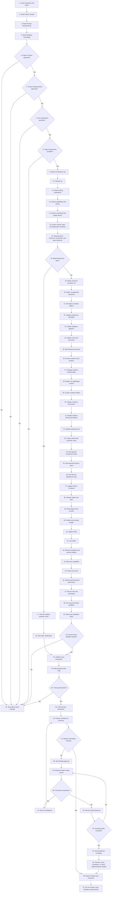

# Product Architecture Design Flowchart

```mermaid
flowchart TD
    S01[1. Locate repository and inputs] --> S02[2. Read Project Context]
    S02 --> S03[3. Read Product Requirements]
    S03 --> S04[4. Read Workflow Traceability]
    S04 --> S05{5. Project Context approved?}
    S05 -->|No| S51[51. Stop without trace changes]
    S05 -->|Yes| S06{6. Product Requirements approved?}
    S06 -->|No| S51
    S06 -->|Yes| S07{7. Zero requirement questions?}
    S07 -->|No| S51
    S07 -->|Yes| S08{8. Initial requirements complete?}
    S08 -->|No| S51
    S08 -->|Yes| S09[9. Detect Architecture row]
    S09 --> S10[10. Classify run]
    S10 --> S11[11. Read existing architecture]
    S11 --> S12[12. Extract capabilities and stories]
    S12 --> S13[13. Extract constraints and quality drivers]
    S13 --> S14[14. Extract context, data, and deployment evidence]
    S14 --> S15[15. Separate facts, decisions, constraints, and open decisions]
    S15 --> S16{16. Material decisions open?}
    S16 -->|Yes| S17[17. Ask first material question round]
    S17 --> S18[18. Set Under Clarification]
    S18 --> S52[52. Initialize trace transaction]
    S16 -->|No| S19[19. Define minimum container set]
    S19 --> S20[20. Reject unsupported containers]
    S20 --> S21[21. Normalize container folders]
    S21 --> S22[22. Update architecture README]
    S22 --> S23[23. Update diagrams gitignore]
    S23 --> S24[24. Update root arc42 document]
    S24 --> S25[25. Add viewing instructions]
    S25 --> S26[26. Preserve twelve arc42 sections]
    S26 --> S27[27. Populate sections proportionally]
    S27 --> S28[28. Explain non-applicable content]
    S28 --> S29[29. Create container folders]
    S29 --> S30[30. Update container documents]
    S30 --> S31[31. Identify material internal boundaries]
    S31 --> S32[32. Update workspace.dsl]
    S32 --> S33[33. Create context and container views]
    S33 --> S34[34. Add required Component views]
    S34 --> S35[35. Add selected Dynamic views]
    S35 --> S36[36. Add relevant Deployment view]
    S36 --> S37[37. Update Docker Compose]
    S37 --> S38[38. Declare stable view keys]
    S38 --> S39[39. Keep diagram text concise]
    S39 --> S40[40. Embed only existing images]
    S40 --> S41[41. Update ADRs]
    S41 --> S42[42. Link ADRs]
    S42 --> S43[43. Remove templates and runtime artifacts]
    S43 --> S44[44. Map every capability]
    S44 --> S45[45. Verify every story]
    S45 --> S46[46. Verify product behavior provenance]
    S46 --> S47[47. Record risks and uncertainty]
    S47 --> S48[48. Run unsynchronized validation]
    S48 --> S49[49. Write exact validation report]
    S49 --> S50{50. Synchronized validation passes?}
    S50 -->|No| S51
    S50 -->|Yes| S52
    S52 --> S53[53. Edit proposed trace copy]
    S53 --> S54{54. Trace guard passes?}
    S54 -->|No| S51
    S54 -->|Yes| S55[55. Commit trace transaction]
    S55 --> S56[56. Present architecture summary]
    S56 --> S57{57. Material information missing?}
    S57 -->|Yes| S66[66. Report changes and omissions]
    S57 -->|No| S58[58. Set Pending Approval]
    S58 --> S59[59. Request explicit review record]
    S59 --> S60{60. Corrections requested?}
    S60 -->|Yes| S61[61. Rerun all validators]
    S61 --> S56
    S60 -->|No| S62[62. Record explicit approval]
    S62 --> S63{63. Essential ADRs accepted?}
    S63 -->|No| S59
    S63 -->|Yes| S64[64. Set Architecture Complete]
    S64 --> S65[65. Choose e-sync, foundation, or future implementation handoff]
    S65 --> S66
    S66 --> S67[67. Do not invoke e-sync-repository-requirements]
```
