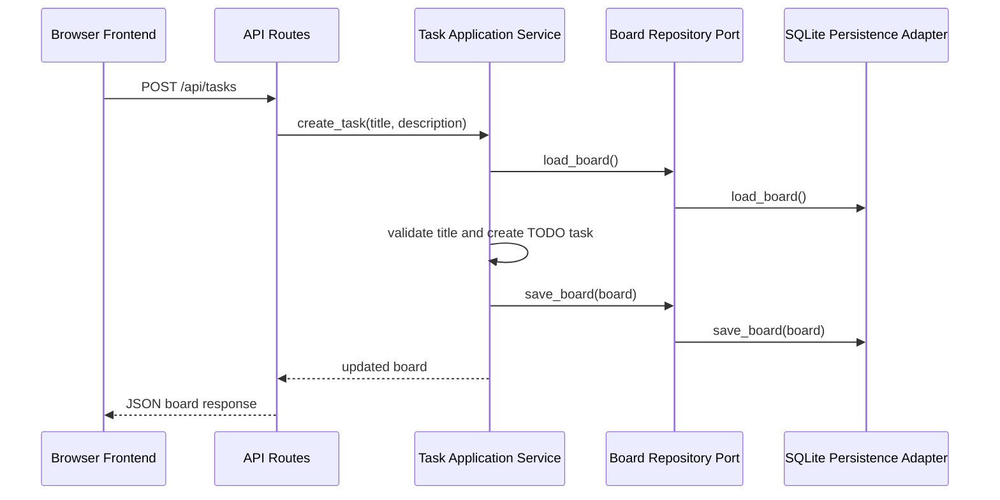
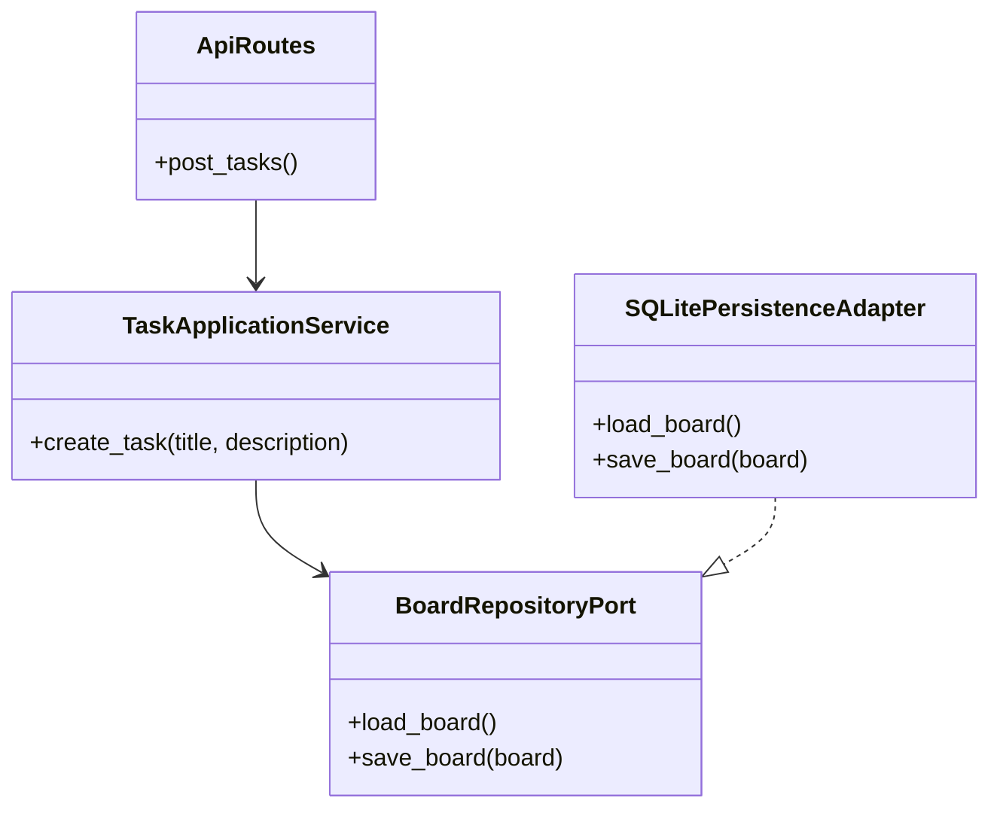

# Code-Level Implementation Map

## Purpose

Guide issue-by-issue implementation while preserving the approved Browser Task Board architecture. This document is maintained by `g-implement-repository-work` as code structure becomes real through TDD.

## Documentation Structure

- Central index: `sdlc_docs/02_architecture/code-level.md`
- Flask Backend map: `sdlc_docs/02_architecture/containers/flask-backend/code-level.md`
- Browser Frontend map: deferred until an approved issue changes frontend code.
- Structurizr remains canonical for C4 views; Mermaid diagrams document code-level interactions and module relationships.

## US-0001 - Create a Task

### Architecture Mapping

| Code area | Architecture element | Responsibility |
|---|---|---|
| API route handler | API Routes | Accept `POST /api/tasks` and return JSON. |
| Create-task service | Task Application Service | Validate approved task fields and create TODO tasks. |
| Repository protocol | Board Repository Port | Save and load board state through a backend-owned boundary. |
| SQLite adapter | SQLite Persistence Adapter | Persist board state behind the repository port when introduced by the issue. |

### Sequence



### Backend Class and Port Shape



### Planned Contract

`POST /api/tasks`

Request:

```json
{
  "title": "Write tests",
  "description": "Optional detail"
}
```

Response:

```json
{
  "tasks": [
    {
      "id": "<server-generated id>",
      "title": "Write tests",
      "description": "Optional detail",
      "status": "TODO"
    }
  ],
  "counts": {
    "pending": 1,
    "current": 0,
    "completed": 0
  }
}
```

### TDD Constraint

Create each code element only after a related failing pytest proves the selected US-0001 behavior is missing.
