# Repository Work Implementation Flowchart

```mermaid
flowchart TD
    S00[Start: locate repository root] --> MODE{Choose operating mode}

    MODE -->|Backlog priority planning| P01[1. Confirm priority planning mode]
    P01 --> P02[2. Read unresolved issues or work items]
    P02 --> P03[3. Read requirements, architecture, trace, and existing 03_implementation docs]
    P03 --> P04{4. Preparation and foundation Complete?}
    P04 -->|No| STOP[Stop without repository writes]
    P04 -->|Yes| P05[5. Inspect Git state and issue source freshness]
    P05 --> P06[6. Read backlog priority policy]
    P06 --> P07[7. Draft priority order and artifact update]
    P07 --> P08[8. Present planning proposal]
    P08 --> P09{9. Explicit approval received?}
    P09 -->|No| STOP
    P09 -->|Yes| P10[10. Update sdlc_docs/03_implementation docs]
    P10 --> P11[11. Review diff for scope and manual-only wording]
    P11 --> P12[12. Present priority result]
    P12 --> P13[13. Stop without GitHub, project-board, or version-control actions]

    MODE -->|Single issue implementation| I01[1. Read selected issue]
    I01 --> I02{2. Exactly one issue in scope?}
    I02 -->|No| STOP
    I02 -->|Yes| I03[3. Read requirements and acceptance criteria]
    I03 --> I04[4. Read architecture, ADRs, trace, 03_implementation guidance, and code-level docs]
    I04 --> I05{5. Preparation and foundation Complete?}
    I05 -->|No| STOP
    I05 -->|Yes| I06[6. Inspect source, tests, commands, and Git state]
    I06 --> I07[7. Run relevant baseline tests]
    I07 --> I08[8. Classify work]
    I08 --> I09[9. Read best-practice references]
    I09 --> I10[10. Run Tester driver and Developer navigator review]
    I10 --> I11[11. Draft developer code design]
    I11 --> I12[12. Decide central and per-container code-level updates]
    I12 --> I13[13. Identify useful Mermaid diagrams]
    I13 --> I14[14. Map behavior to tests and locations]
    I14 --> I15[15. Prepare local implementation proposal]
    I15 --> I16{16. Explicit approval received?}
    I16 -->|No| STOP
    I16 -->|Yes| I17[17. Re-read issue and affected state]
    I17 --> I18[18. Select smallest remaining behavior]
    I18 --> I19[19. Tester driver creates test, confirm RED, and report status]
    I19 --> I20[20. Developer navigator implements for RED, confirm GREEN, and report status]
    I20 --> I21[21. Refactor, preserve GREEN, and report status]
    I21 --> I22{22. More approved behavior?}
    I22 -->|Yes| I18
    I22 -->|No| I23[23. Run relevant test categories]
    I23 --> I24[24. Run full foundation quality commands]
    I24 --> I25[25. Review diff and code-level alignment]
    I25 --> I26[26. Run objective result validator]
    I26 --> I27[27. Update local status-tracking docs]
    I27 --> I28[28. Present evidence, status tracking, and limitations]
    I28 --> I29[29. Stop without remote or version-control actions]
    I29 --> I30[30. Propose any such action separately]
```

## Alignment Rules

- The mode branch must match `SKILL.md` operating modes.
- Backlog priority planning creates only `sdlc_docs/03_implementation/` coordination artifacts.
- Single issue implementation keeps exactly one issue in scope.
- Code-level architecture stays under `sdlc_docs/02_architecture/` using the central index plus per-container maps.
- Structurizr remains canonical for C4 views; Mermaid diagrams document code-level sequence, flow, class/module, and object/state design in Markdown.
- Ping-Pong TDD uses the visible role names `Tester driver` and `Developer navigator`.
- Tester driver defines intended logic with tests before Developer navigator implements production code.
- The user is kept informed about proposed tests, created tests, and current RED-GREEN-REFACTOR status.
- Single issue implementation updates only local implementation status-tracking docs after validation, including `sdlc_docs/trace_workflow.md` and `sdlc_docs/03_implementation/backlog_priority.md` when present; earlier phase rows and remote issue/project state require separate approval.
- Failed preconditions stop before repository writes.
- Local planning or implementation approval does not authorize deviations or remote actions.
