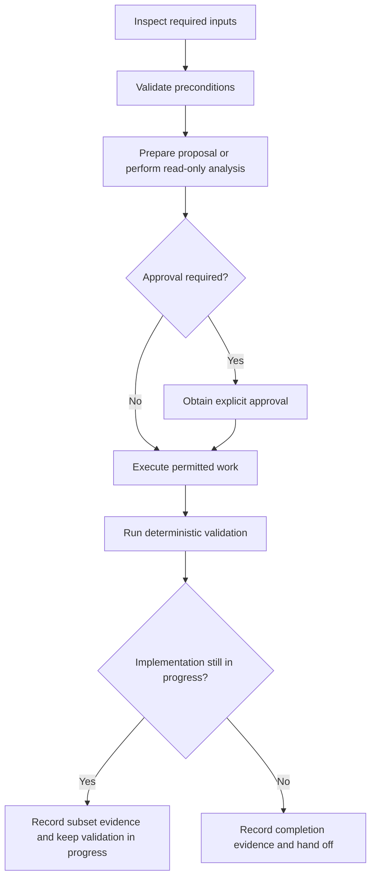

# Process Flowchart

```mermaid
flowchart TD
    A[Inspect required inputs] --> B[Validate preconditions]
    B --> C[Prepare proposal or perform read-only analysis]
    C --> D{Approval required?}
    D -- Yes --> E[Obtain explicit approval]
    D -- No --> F[Execute permitted work]
    E --> F
    F --> G[Run deterministic validation]
    G --> H{Implementation still in progress?}
    H -- Yes --> I[Record subset evidence and keep validation in progress]
    H -- No --> J[Record completion evidence and hand off]
```

This audit view summarizes `i-validate-user-story-completion`. The skill entrypoint and validators remain authoritative.
