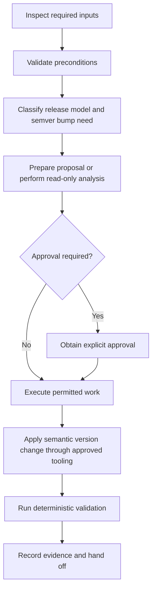

# Process Flowchart

```mermaid
flowchart TD
    A[Inspect required inputs] --> B[Validate preconditions]
    B --> C[Classify release model and semver bump need]
    C --> D[Prepare proposal or perform read-only analysis]
    D --> E{Approval required?}
    E -- Yes --> F[Obtain explicit approval]
    E -- No --> G[Execute permitted work]
    F --> G
    G --> H[Apply semantic version change through approved tooling]
    H --> I[Run deterministic validation]
    I --> J[Record evidence and hand off]
```

This audit view summarizes `j-prepare-release-deployment`. The skill entrypoint and validators remain authoritative.
