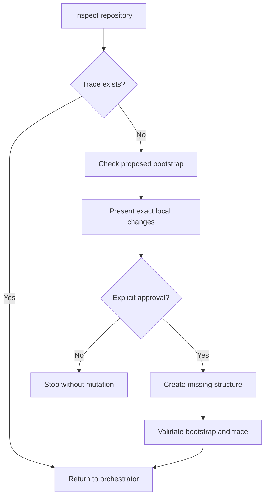

# Process Flowchart

```mermaid
flowchart TD
    A[Inspect repository] --> B{Trace exists?}
    B -- Yes --> C[Return to orchestrator]
    B -- No --> D[Check proposed bootstrap]
    D --> E[Present exact local changes]
    E --> F{Explicit approval?}
    F -- No --> G[Stop without mutation]
    F -- Yes --> H[Create missing structure]
    H --> I[Validate bootstrap and trace]
    I --> C
```
