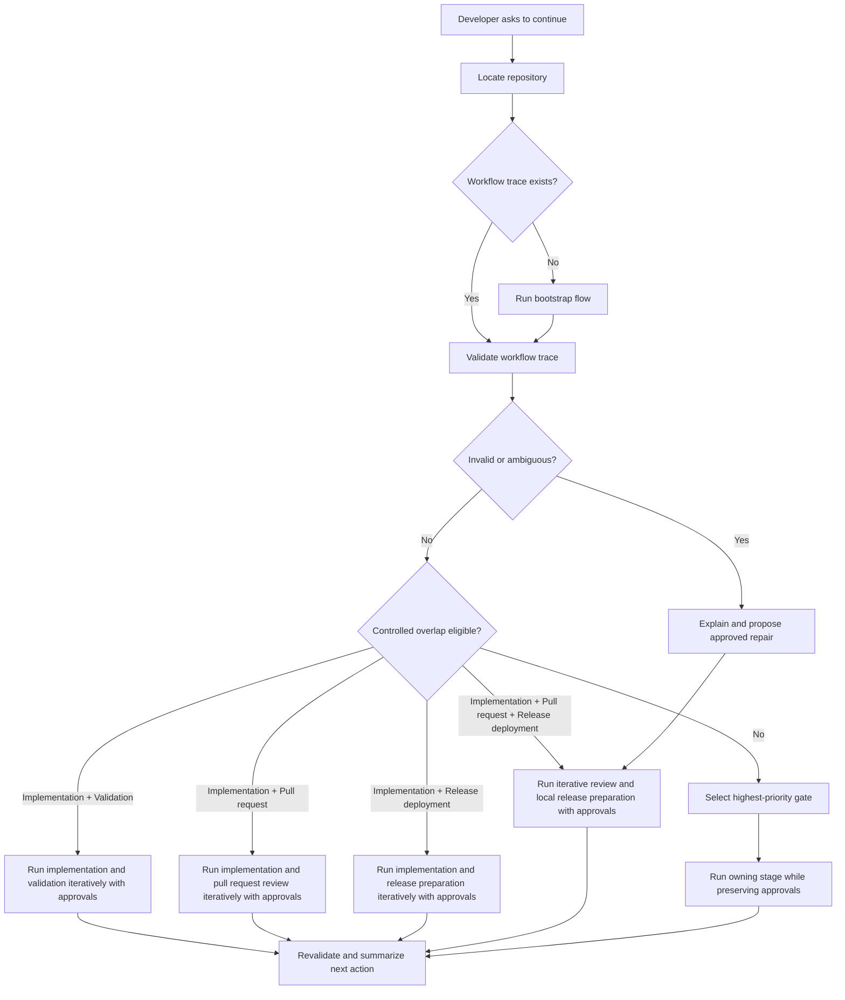

# Process Flowchart

```mermaid
flowchart TD
 A[Developer asks to continue] --> B[Locate repository]
 B --> C{Workflow trace exists?}
 C -- No --> D[Run bootstrap flow]
 C -- Yes --> E[Validate workflow trace]
 D --> E
 E --> F{Invalid or ambiguous?}
 F -- Yes --> G[Explain and propose approved repair]
 F -- No --> H{Controlled overlap eligible?}
 H -- Implementation + Validation --> I[Run implementation and validation iteratively with approvals]
 H -- Implementation + Pull request --> J[Run implementation and pull request review iteratively with approvals]
 H -- Implementation + Release deployment --> K[Run implementation and release preparation iteratively with approvals]
 H -- Implementation + Pull request + Release deployment --> L[Run iterative review and local release preparation with approvals]
 H -- No --> M[Select highest-priority gate]
 M --> N[Run owning stage while preserving approvals]
 I --> O[Revalidate and summarize next action]
 J --> O
 K --> O
 L --> O
 N --> O
 G --> L
```
